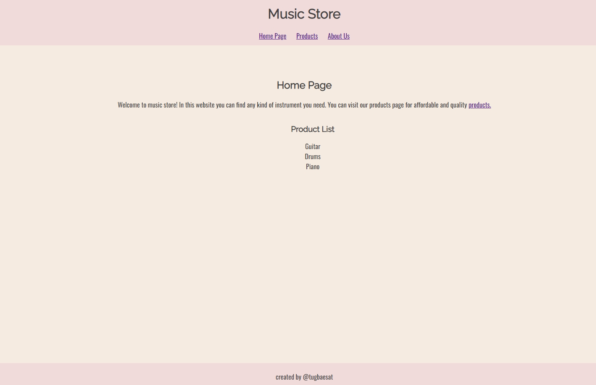
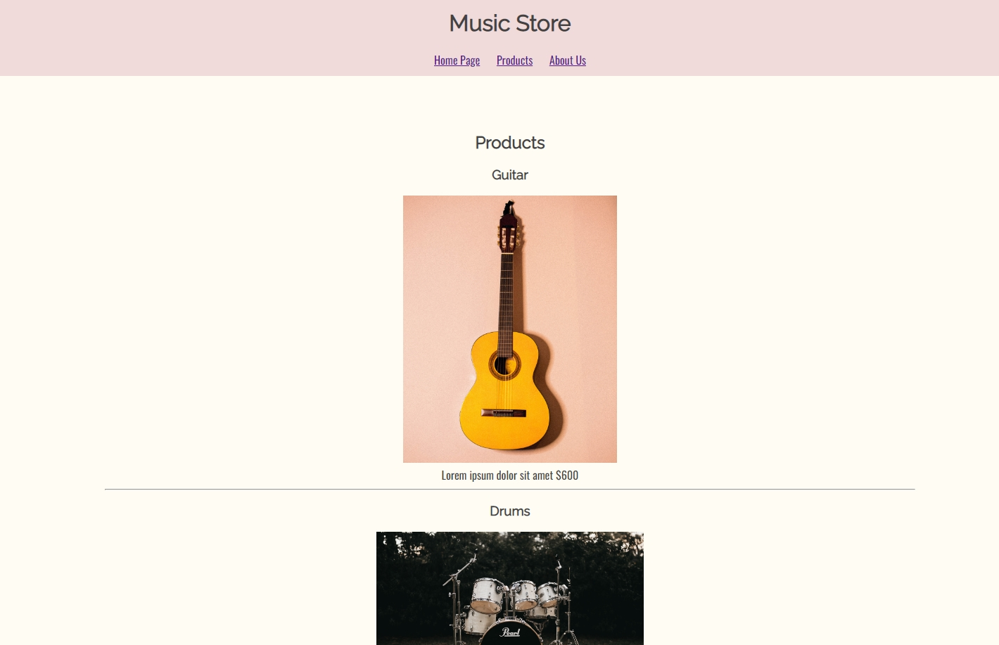
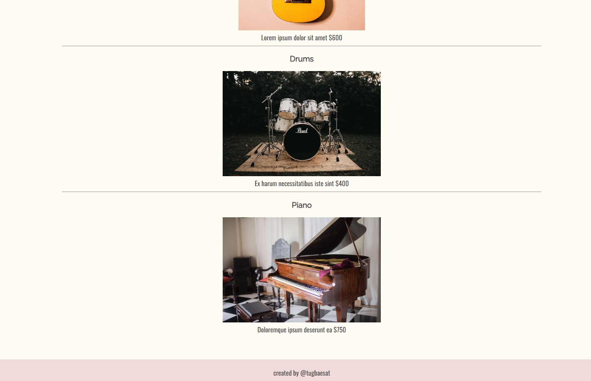
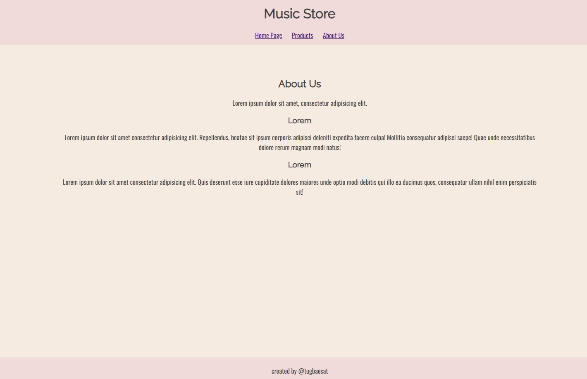

# Patika.dev/kodluyoruz CSS Project

## About the Project: 📚
This project is created to practise CSS skills in the scope of "Frontend Web Development Course-Beginner Level". You can access the project from
[Patika.dev.](https://app.patika.dev/courses/css/odev1
)
## Screenshots: 📷

- Home Page

- Products Page

- About Us Page

## Technologies Used: ☕️ 🐍 ⚛️

### Built with

- HTML
- CSS

## Author
- patika.dev account [@tugbaesat](https://app.patika.dev/tugbaesat)
