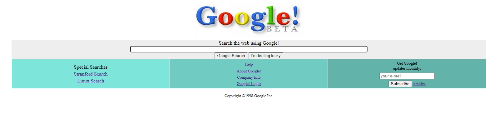

#  GOOGLE 1998 CLONE PROJECT 

## About the Project: 📚
This project is created to practice CSS skills in the scope of "Frontend Web Development Course-Beginner Level". You can access the project from
[Patika.dev.](https://app.patika.dev/courses/css/odev2)
## Screenshots: 📷

- Google 1998

## Technologies Used: ⚛️

### Built with

- HTML
- CSS

## Author
- patika.dev account [@tugbaesat](https://app.patika.dev/tugbaesat)
